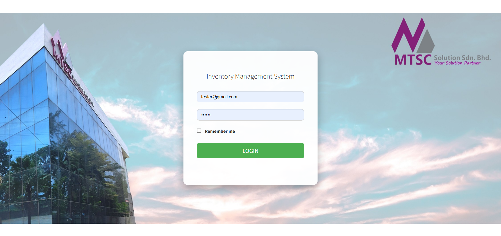

  

# 📦 MTSC Inventory Management System

Sistem **Inventory Management berbasis Web** yang dikembangkan untuk membantu pengelolaan stok barang pada perusahaan **MTSC Singapore**.  
Aplikasi ini dirancang untuk meningkatkan efisiensi pencatatan barang, pengelolaan pengguna, serta monitoring stok secara terpusat.

Proyek ini juga dibuat sebagai **syarat penyelesaian Tugas Akhir Diploma 3 (D3) Program Studi Teknik Informatika** di Politeknik Negeri Batam.

---

## 🎯 Project Purpose

Tujuan dari pengembangan sistem ini adalah:

- Membantu **MTSC Singapore** dalam mengelola data inventory secara digital
- Mengurangi kesalahan pencatatan manual
- Mempermudah proses **monitoring stok barang**
- Menyediakan **sistem manajemen user** dengan hak akses tertentu
- Menyediakan sistem inventory yang **lebih cepat, akurat, dan terorganisir**

---

## 🏢 About MTSC

**MTSC Singapore** merupakan perusahaan yang bergerak di bidang teknologi dan manufaktur elektronik.  
Dalam operasional sehari-hari, pengelolaan inventory merupakan bagian penting untuk memastikan ketersediaan komponen dan material produksi.

Sistem ini dikembangkan untuk membantu proses tersebut agar menjadi lebih efisien dan terdigitalisasi.

---

## 🚀 Features

Berikut fitur utama dari sistem ini:

### 👤 User Management
- Menambahkan user baru
- Mengedit data user
- Menghapus user
- Sistem proteksi user bawaan sistem (ID 1,2,3 tidak dapat dihapus)

### 📦 Inventory Management
- Manajemen data barang
- Menambah stok barang
- Update stok barang
- Monitoring stok inventory

### 📊 Dashboard
- Tampilan ringkasan data inventory
- Monitoring data secara cepat

### 🔐 Authentication
- Login sistem
- Role user (Admin / Staff)

### 🧪 System Testing
- Unit testing menggunakan Laravel testing
- Pengujian fitur login, logout, dan manajemen user

---

## 🛠️ Technology Stack

Teknologi yang digunakan dalam pengembangan sistem ini:

| Technology | Description |
|-----------|-------------|
| Laravel | Backend framework |
| PHP | Programming language |
| MySQL | Database |
| Bootstrap | User Interface |
| DataTables | Interactive table |
| jQuery | Frontend scripting |

---

## 🏗️ System Architecture

Sistem ini dikembangkan menggunakan pola arsitektur:

**MVC (Model - View - Controller)**
